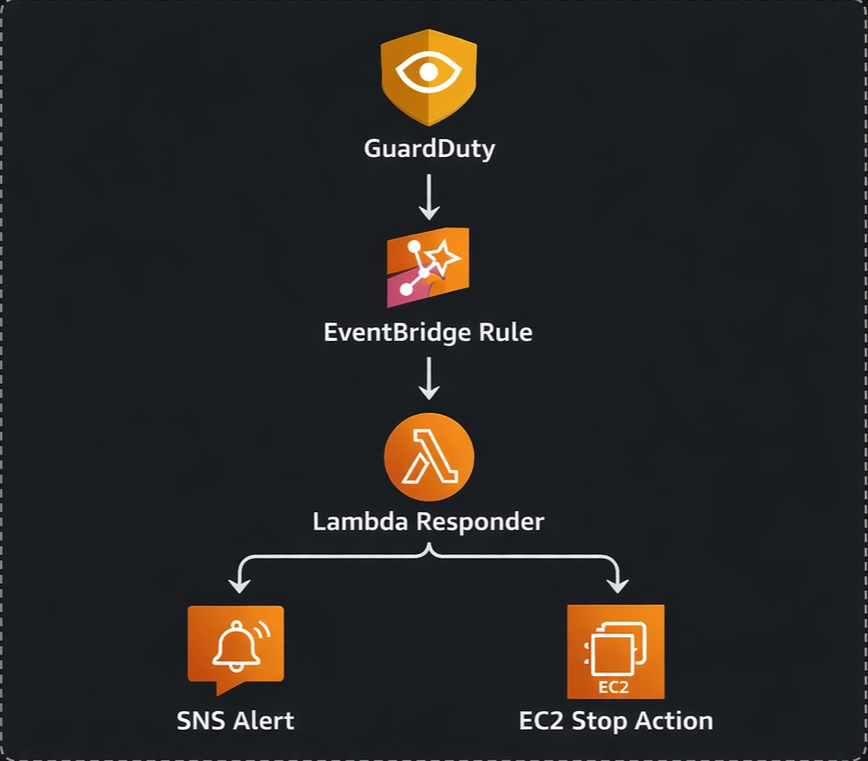

# AWS GuardDuty Automated Incident Response Lab

Terraform-based AWS cloud security project that detects GuardDuty findings, routes them through EventBridge, triggers a Lambda responder, sends SNS alerts, and automatically stops an affected EC2 instance based on configurable remediation logic.

---

## Project Overview

This project demonstrates how AWS-native security findings can be converted into an automated incident response workflow.

Instead of treating GuardDuty findings as passive alerts, this lab turns them into real actions:

- **GuardDuty** detects suspicious activity
- **EventBridge** routes the finding event
- **Lambda** parses the finding and executes response logic
- **SNS** sends an incident alert email
- **EC2** is automatically contained by stopping the affected instance

This project was built as a hands-on cloud security lab to demonstrate event-driven remediation, infrastructure as code, and AWS-native incident response design.

---

## Why This Project Matters

In real cloud environments, security teams cannot manually respond to every finding fast enough. A common industry pattern is to connect managed detection services to automated response workflows that can:

- reduce response time
- improve consistency
- alert responders immediately
- contain high-risk assets before manual review completes

This lab demonstrates that pattern in a focused and explainable way using core AWS services.

---

## Architecture Diagram

