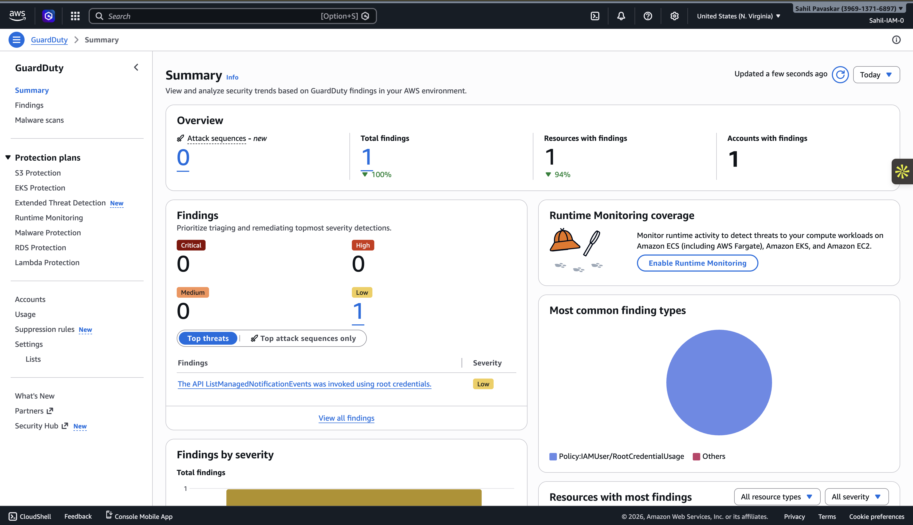
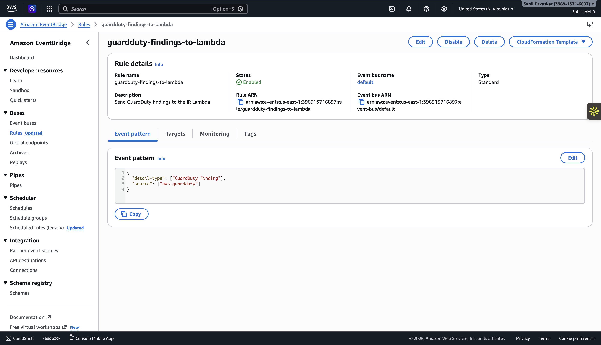
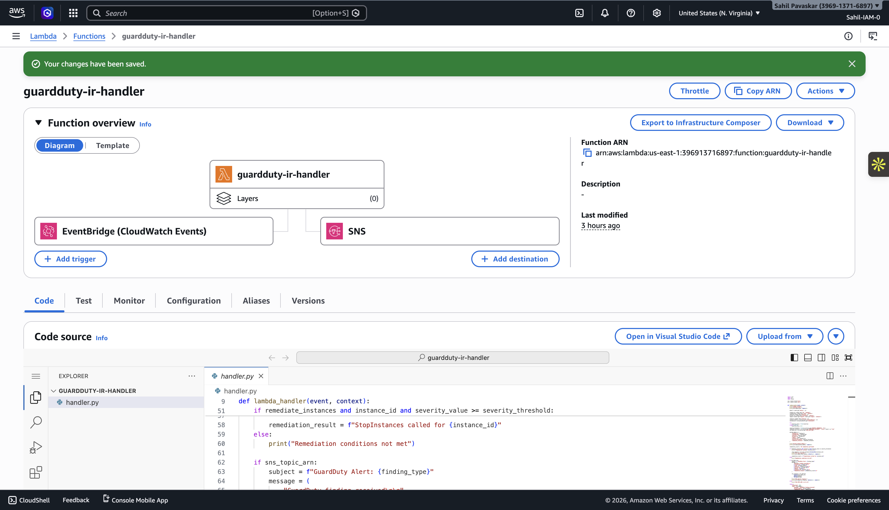
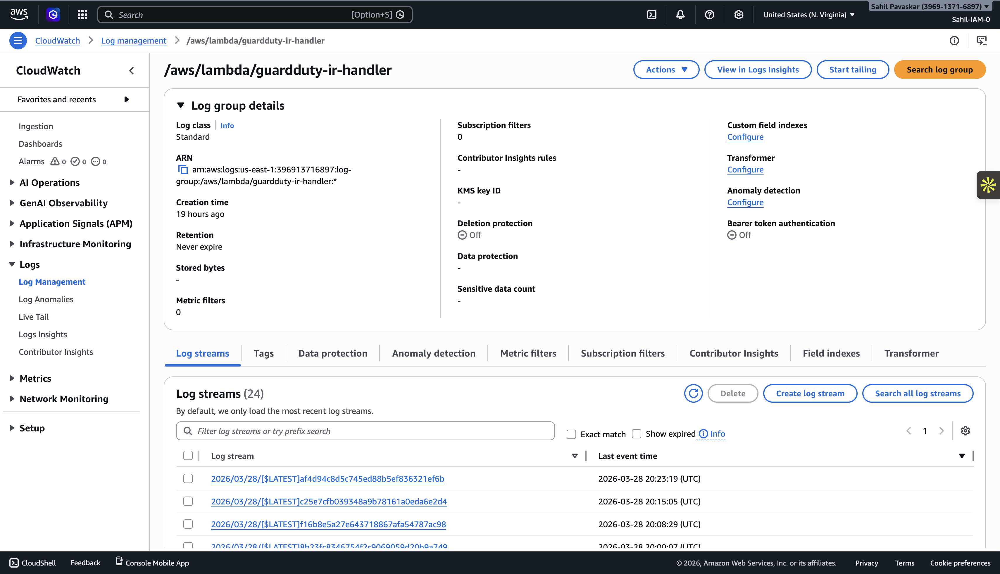
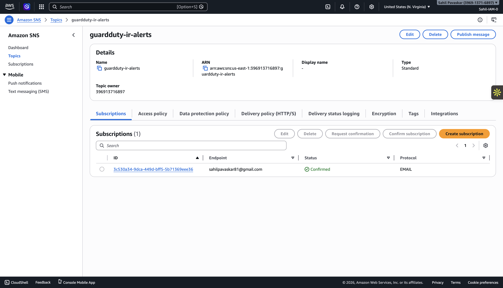
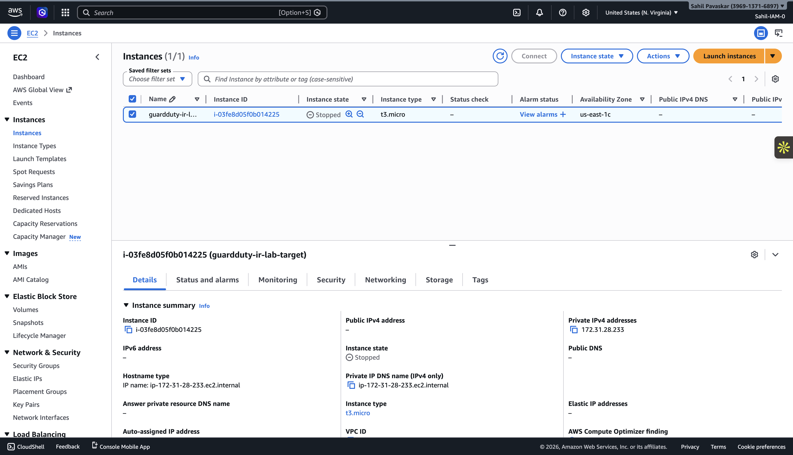

# Testing and Validation

This document describes how the AWS GuardDuty Incident Response Lab was validated and what evidence was used to confirm that the workflow operated as expected.

## Purpose

The goal of testing was to confirm that the event-driven response pipeline worked end to end:

1. Amazon GuardDuty generated or exposed a finding
2. Amazon EventBridge matched and routed the event
3. AWS Lambda processed the finding
4. Amazon SNS delivered an alert
5. Amazon EC2 was stopped when remediation conditions were met

The testing approach focused on verifying both detection flow and response behavior.

## Validation Scope

The following parts of the solution were validated:

- GuardDuty was enabled and generating findings
- EventBridge was configured to capture GuardDuty findings
- Lambda was invoked successfully by EventBridge
- Lambda logs showed correct processing behavior
- SNS notifications were delivered by email
- EC2 remediation occurred when enabled and threshold conditions were satisfied

## Test Environment

The lab was tested in an AWS environment using the following services:

- Amazon GuardDuty
- Amazon EventBridge
- AWS Lambda
- Amazon SNS
- Amazon EC2
- Amazon CloudWatch Logs
- AWS IAM

Terraform was used to deploy the infrastructure, and Python with Boto3 was used in the Lambda function.

## Test Method

The project was validated by deploying the infrastructure, confirming the configuration of each service, and then observing the expected outputs across the workflow.

Testing included:

- checking that GuardDuty was enabled
- confirming that the EventBridge rule existed
- verifying that the Lambda function was deployed correctly
- reviewing CloudWatch logs for Lambda execution details
- confirming receipt of the SNS email alert
- verifying the EC2 instance stop action when remediation was triggered

## Validation Steps

### 1. Confirm GuardDuty is Enabled

The first validation step was to verify that GuardDuty was enabled in the target AWS region.

Evidence:
- GuardDuty service status shown in the AWS console

Screenshot:

### 2. Confirm EventBridge Rule Configuration

The next step was to verify that an EventBridge rule existed to capture GuardDuty findings and route them to Lambda.

Evidence:
- EventBridge rule present and configured
- Rule target pointed to the Lambda response function

Screenshot:

### 3. Confirm Lambda Deployment

The Lambda function was verified to ensure that it had been deployed successfully and configured with the intended environment variables and execution role.

Evidence:
- Lambda function visible in the AWS console
- Function configuration available for review

Screenshot:

### 4. Review Lambda Execution Logs

CloudWatch logs were reviewed after the workflow ran to confirm that Lambda had received and processed the event.

Evidence reviewed in logs included:
- function invocation
- event parsing
- severity evaluation
- SNS publishing
- remediation decision or action

Screenshot:

### 5. Confirm SNS Alert Delivery

SNS email delivery was validated by confirming that the alert message was received at the subscribed email address.

Evidence:
- email notification received
- message contained finding and response details

Screenshot:

### 6. Confirm EC2 Remediation

The final validation step was to confirm that the EC2 instance was stopped when:
- remediation was enabled
- the finding severity met or exceeded the configured threshold

Evidence:
- target EC2 instance shown in stopped state

Screenshot:

## Expected Outcome

A successful end-to-end run of the lab should demonstrate the following:

- A GuardDuty finding enters the workflow
- EventBridge routes the event correctly
- Lambda processes the event without error
- SNS sends an alert successfully
- EC2 remediation occurs only when the configured conditions are met

This confirms that the pipeline functions as both a detection and a response mechanism.

## Observations

The testing process showed that the architecture successfully connected managed AWS services into a simple but effective automated response workflow.

A few key observations from validation:

- EventBridge provides a clean routing layer for security findings
- Lambda is well-suited for lightweight response logic
- SNS provides a simple and effective way to make the workflow visible
- CloudWatch logs are essential for troubleshooting and proving behavior
- Environment-variable-based controls make it easy to switch between alert-only and remediation-enabled modes

## Limitations of Testing

This validation focused on demonstrating the core lab workflow. It did not include:

- large-scale or repeated load testing
- multi-account GuardDuty aggregation scenarios
- advanced fault injection
- external SIEM or case management integrations
- extensive testing across multiple finding types

These are reasonable limitations for a portfolio lab and do not reduce the value of the project as a demonstration of core AWS security automation concepts.

## Conclusion

Testing confirmed that the AWS GuardDuty Incident Response Lab worked as intended. The project successfully demonstrated an event-driven incident response pipeline in which GuardDuty findings were routed through EventBridge, processed by Lambda, alerted through SNS, and used to trigger optional EC2 remediation.
